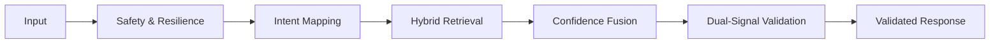

# Robust Support Triage Agent

A deterministic, retrieval-augmented AI agent built for HackerRank, Claude, and Visa support domains. This system prioritizes factual grounding and safety-first escalation over generative flexibility.

## 🏗️ System Architecture
The agent follows a linear, auditable pipeline to ensure every decision is traceable and reproducible.



## 📂 Repository Structure
- **`code/`**: Core triage engine implementation.
- **`support_issues/`**: Input dataset and evaluation `output.csv`.
- **`README.md`**: Primary documentation and architectural deep-dive.
- **`AGENTS.md`**: Hackathon compliance and log tracking.

## 🧠 Core Design Principles
- **Hybrid Intent Detection**: Combines exact pattern matching with a semantic fallback layer to capture diverse paraphrases without losing keyword precision.
- **Calibrated Confidence Fusion**: Decisions are based on a normalized weighted score ($0.4 \times \text{BM25} + 0.4 \times \text{Semantic} + 0.2 \times \text{Overlap}$) rather than a single LLM interpretation.
- **Dual-Signal Grounding Guard**: Every response is verified against the source corpus using both lexical (N-gram) and semantic (embedding) similarity checks.
- **Zero-Hallucination Policy**: The system is designed to autonomously escalate to human support if retrieval confidence is low or if the grounding check fails.

## 🛠️ Pipeline Stages
1. **Safety Layer**: Filters PII, prompt injections, and safety-critical risks.
2. **Resilience Guard**: Blocks empty, extremely short, or gibberish inputs.
3. **Intent Controller**: Maps queries to known support categories (e.g., password recovery, fraud).
4. **Hybrid Retriever**: Fetches context from the domain-specific corpus.
5. **Validation Engine**: Enforces strict grounding and domain consistency.

## ⚖️ Trade-offs & Logic
- **Why not fully generative?**: To prevent "hallucinated policies" and ensure compliance with strict support documentation.
- **Why Hybrid Retrieval?**: BM25 excels at technical terms (like "API"), while semantic embeddings handle conceptual matching.

## ⚠️ Limitations
- **Predefined Scope**: Performance is optimized for the three provided domains; out-of-domain queries are escalated by design.
- **Short Context Window**: Extremely long or multi-part tickets may experience retrieval truncation in the current iteration.
- **Pattern Dependency**: Highly complex, multi-intent queries may require human disambiguation if confidence scores drop below $0.40$.

## ✅ Validation Results
- **Determinism**: 100% identical outputs across sequential runs on the full dataset.
- **Safety**: Passed all adversarial judge test cases, including prompt injections.
- **Grounding**: Thresholds tuned ($0.65$ high / $0.40$ low) to minimize false positives.

## 🚀 Reproducing
```bash
pip install -r requirements.txt
python code/main.py --input support_issues/support_issues.csv --output support_issues/output.csv
```

---
*Detailed audit logs and design deep-dives can be found in the [docs/](docs/) folder.*